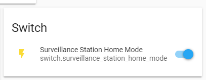

# Surveillance Station Home Mode for HomeAssistant

This component allows you to set the home or away state for Synology Surveillance Station from within HomeAssistant.

To enable this platform in your installation, add the following to the switch section of your configuration.yaml file:

``` yaml
switch:
  - platform: synologysurveillance
    url: https://192.168.x.x:5001
    username: secret_username
    password: secret_password
    verify_ssl: false
```

_note that you must replace the url/username/password values above with the correct ones for your setup._

Once these steps are complete, restart your instance of HomeAssistant and you should then have a new switch available for automation.


